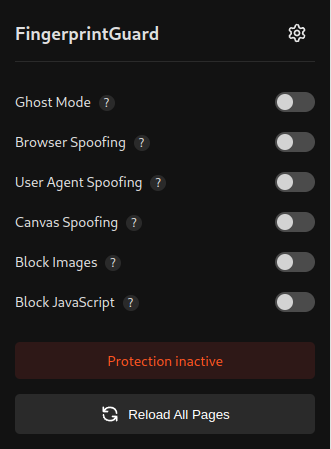
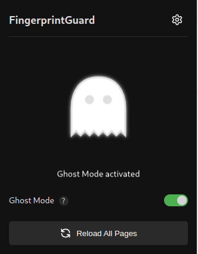

# 🛡️ FingerprintGuard - Extension de Protection contre le Fingerprinting



## 📖 Description

FingerprintGuard est une extension de navigateur avancée qui vous protège contre le fingerprinting et améliore votre confidentialité en ligne. Elle propose plusieurs modes de protection incluant le spoofing intelligent, la protection WebRTC, et un mode fantôme pour une anonymisation complète.

## ✨ Fonctionnalités principales

### 🎭 Protections disponibles
- **Mode Fantôme** : Anonymisation complète en masquant toutes les propriétés sensibles
- **Spoofing du Navigateur** : Falsification des propriétés navigator, User-Agent et Client Hints  
- **Spoofing Canvas** : Protection contre le fingerprinting via Canvas
- **Spoofing d'Écran** : Falsification des propriétés d'affichage
- **Blocage d'Images/JS** : Contrôle du chargement de contenu

### 🔧 Fonctionnalités avancées
- **Profils personnalisés** : Sauvegarde et réutilisation de configurations de spoofing
- **Génération automatique** : Création de profils cohérents et réalistes
- **Protection WebRTC** : Prévention des fuites d'IP réelle
- **Raccourcis clavier** : Activation rapide des fonctionnalités
- **Interface moderne** : Design élégant avec thème sombre/clair

## 🚀 Installation

### Chrome/Chromium
1. Téléchargez ou clonez ce repository
2. Ouvrez `chrome://extensions/`
3. Activez le "Mode développeur"
4. Cliquez sur "Charger l'extension non empaquetée"
5. Sélectionnez le dossier de l'extension

### Firefox (bientôt supporté)
Le support Firefox est prévu dans une future version avec adaptation au manifest v2.

## ⚙️ Configuration

### Premier lancement
1. Cliquez sur l'icône de l'extension dans la barre d'outils
2. Activez les protections souhaitées
3. Optionnel : Configurez des profils personnalisés via les paramètres
4. Les protections s'appliquent automatiquement aux nouveaux onglets

### Options disponibles
- **Mode Fantôme** : Protection maximale (désactive les autres options)
- **Spoofing intelligent** : Falsification cohérente des données
- **Blocages sélectifs** : Images et/ou JavaScript selon vos besoins
- **Rechargements automatiques** : Application immédiate des changements

## 🧪 Tester l'efficacité

Vérifie l'efficacité de FingerprintGuard sur ces sites :

1. **What Is My Browser** : [whatismybrowser.com](https://www.whatismybrowser.com)
2. **BrowserLeaks** : [browserleaks.com](https://browserleaks.com)
3. **Cover Your Tracks** : [coveryourtracks.eff.org](https://coveryourtracks.eff.org)

⚠️ **Note** : Le **Mode Fantôme** peut affecter le fonctionnement de certains sites web.

## 📸 Screenshots


*Interface principale de FingerprintGuard*


*Mode Fantôme activé pour une protection maximale*

## 🛠️ Développement

### Structure du projet
```
FingerprintGuard/
├── manifest.json          # Configuration de l'extension
├── background.js          # Service worker principal  
├── popup.html/js          # Interface utilisateur
├── settings.html/js       # Page de configuration
├── spoofing-data.js      # Génération des données factices
├── spoofing-apply.js     # Application du spoofing
├── utils.js              # Fonctions utilitaires
├── advanced-protection.js # Protections avancées
└── spoofer/              # Scripts de protection
```

### APIs utilisées
- `chrome.scripting` : Injection de scripts de protection
- `chrome.storage` : Sauvegarde des paramètres et profils  
- `chrome.declarativeNetRequest` : Modification des en-têtes HTTP
- `chrome.webNavigation` : Détection de navigations
- `chrome.contentSettings` : Blocage d'images/JavaScript

## 🔒 Sécurité et Confidentialité

### Données collectées
- **Aucune donnée personnelle** n'est collectée ou transmise
- Toutes les configurations sont stockées localement
- Aucune télémétrie ou analytics

### Fonctionnement hors ligne
L'extension fonctionne entièrement en local, aucune connexion internet n'est requise.

## 📝 Changelog

### Version 2.1.0 (Actuelle)
- 🐛 **Corrections majeures** : Gestion d'erreurs robuste, validation des paramètres
- ⚡ **Performance** : Optimisation de l'injection de scripts, mise en cache des profils  
- 🔒 **Sécurité** : Validation des URLs, protection contre les injections
- 🎨 **Interface** : Messages d'erreur améliorés, thème sombre/clair

Voir [IMPROVEMENTS.md](IMPROVEMENTS.md) pour la liste détaillée des améliorations.

## ⚠️ Avertissement

Cette extension est destinée à des fins de protection de la vie privée et de recherche. L'utilisation pour contourner des mesures de sécurité ou à des fins malveillantes n'est pas encouragée. Utilisez-la de manière responsable et respectez les conditions d'utilisation des sites web.

## 📄 Licence

Ce projet est sous licence MIT. Voir le fichier [LICENSE](LICENSE) pour plus de détails.

---

**Développé avec ❤️ pour la protection de la vie privée en ligne.**
